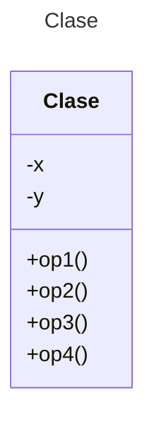

# Proyecto - Figuras

Diseña un sistema para manejar figuras geométricas: círculos, elipses, rectángulos y cuadrados. Usa el patrón de diseño **Factory Method** acorde a los requisitos de diseño siguientes:

* Se tendrá una interface **Figura** para calcular el área y el perímetro de cada figura geométrica.
* Crea clases para manejar cada figura geométrica. Revisa el código que se te ofrece, en especial el uso de la herencia.
* Crea clases para manejar los cálculos geométricos de cada figura. Estas clases se implementarán basadas en **Factory Method**.
* Prueba el funcionamiento de tu programa con las pruebas unitarias que se te incluyen.

** Toma en cuenta los siguientes conceptos geométricos:

La elipse se puede considerar que es una especialización del círculo:

* Recuerda el [área y el perímetro de un círculo](https://www.geogebra.org/m/zvdrbpwr).
* Recuerda el [área y el perímetro de una elipse](https://www.geogebra.org/m/wekZJJG4).

* Recuerda el [área y el perímetro de un cuadrado](https://www.geogebra.org/m/JujCAg6D).
* Recuerda el [área y el perímetro de un rectangulo](https://www.geogebra.org/m/v3v8CeDM).


# Diagrama de clases
[Editor en línea](https://mermaid.live/)

[Referencia-Mermaid](https://mermaid.js.org/syntax/classDiagram.html)

# Uso del proyecto con make

## Default - Compilar+Probar+Ejecutar
```
make
```
## Compilar
```
make compile
```
## Probar todo
```
make test
```
## Ejecutar App
```
make run
```
## Limpiar binarios
```
make clean
```
# Comandos Git-Cambios y envío a Autograding

## Por cada cambio importante que haga, actualice su historia usando los comandos:
```
git add .
git commit -m "Descripción del cambio"
```
## Envíe sus actualizaciones a GitHub para Autograding con el comando:
```
git push origin main
```
# Comandos individuales
## Compilar

```
find ./ -type f -name "*.java" > compfiles.txt
javac -d build -cp lib/junit-platform-console-standalone-1.5.2.jar @compfiles.txt
```
Ejecutar ambos comandos en 1 sólo paso:

```
find ./ -type f -name "*.java" > compfiles.txt ; javac -d build -cp lib/junit-platform-console-standalone-1.5.2.jar @compfiles.txt
```


## Ejecutar Todas la pruebas locales de 1 Test Case

```
java -jar lib/junit-platform-console-standalone-1.5.2.jar -class-path build --select-class miTest.AppTest
```
## Ejecutar 1 prueba local de 1 Test Case

```
java -jar lib/junit-platform-console-standalone-1.5.2.jar -class-path build --select-method miTest.AppTest#appHasAGreeting
```
## Ejecutar App
```
java -cp build miPrincipal.Principal
```
Los comandos anteriores están considerados para un ambiente Linux. [Referencia.](https://www.baeldung.com/junit-run-from-command-line)
